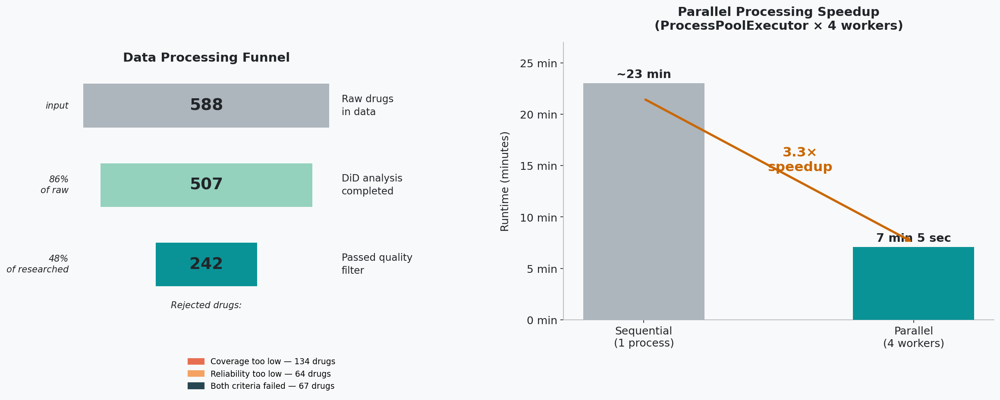

<h1 align="center">Cross-Pharma Market Analysis</h1>

<p align="center">
  When a pharmacy runs out of a drug, where does the demand go?<br>
  A Difference-in-Differences pipeline that measures per-drug substitution coefficients<br>
  across 99 local pharmacy markets — separating drugs the pharmacy can safely optimize<br>
  from drugs whose stock-out permanently loses customers to competitors.
</p>

<p align="center">
  <a href="https://lomanov.dev"></a>
  
  
  
  
  
  
</p>

---

<p align="center">
  
</p>

<p align="center">
  <em>Left: data processing funnel across 99 pharmacy markets — 242 drugs passed both coverage and reliability filters.&nbsp;&nbsp;
  Right: 3.3× runtime speedup with ProcessPoolExecutor × 4 workers.</em>
</p>

---

## Key Findings

- **54% of drugs are SUBSTITUTABLE** — when they go out of stock, the pharmacy retains demand internally: customers switch to an alternative on the same shelf. These drugs can be safely de-prioritized in inventory without losing revenue.
- **46% of drugs are CRITICAL** — stock-out means the customer leaves for a competitor pharmacy. For these drugs, a missed order is a permanently lost sale and a permanently weakened customer relationship.
- **Coverage rate 47.7% is a structural property of the market**, not a data artifact — validated as stable across 5 independent study scenarios (range: 44.4–47.7%), independently of which pharmacies are in the dataset or how many markets are included.
- **DiD isolates the pure substitution signal** — a naive before/after comparison of sales would be confounded by promotions, seasonality, and general market shifts. The pipeline removes all of these by using competitor pharmacies in the same local market as the control group.

---

## The Business Problem

Every stock-out event forces a customer to make a choice:

```
Customer arrives for Drug X (out of stock at target pharmacy)
│
├── Buys a substitute (Drug Y) at the SAME pharmacy   →  INTERNAL demand  (SHARE_INTERNAL)
│
└── Leaves to buy Drug X at a competitor pharmacy     →  LOST demand      (SHARE_LOST)
```

The **substitution coefficient** (SHARE_INTERNAL) quantifies this split per drug, aggregated across 99 local markets. It enables two fundamentally different inventory decisions:

| Coefficient | Classification | Business decision |
|:---:|:---:|:---|
| ≥ 0.5 | **SUBSTITUTABLE** | Optimize inventory depth — if this drug is missing, customers buy an alternative in the same pharmacy. Stock-out does not cost you the customer. |
| < 0.5 | **CRITICAL** | Maintain stock reliability — if this drug is missing, the customer leaves for a competitor. Every stock-out is a loyalty event, not just a missed sale. |

Before this project, pharmacies had no systematic way to distinguish between these two groups at scale. Inventory decisions were made by gut feel, category rules, or supplier pressure — not by measured customer behavior under stock-out conditions.

---

## Why Difference-in-Differences

A naive approach — comparing drug sales at a pharmacy before and after a stock-out — cannot isolate the substitution effect. Sales go up and down for dozens of reasons: seasonality, promotions, competitor price changes, flu season. Any observed change is a confounded mix of all of them.

**DiD controls for all of this** by introducing a control group: competitor pharmacies in the same local market that experienced no stock-out. Whatever happens to sales at competitors during the same period is "background noise" — market-wide dynamics unrelated to the stock-out event. DiD subtracts that noise from what happened at the target pharmacy:

```
LIFT = (Actual sales at target) − (Expected sales based on competitor dynamics)
```

If a competitor's sales of Drug Y went up 15% during a period when the target pharmacy ran out of Drug X, some of that increase is the substitution effect and some is just market-wide growth. DiD separates them. The share of the LIFT that stays inside the target pharmacy on day of restock measures `SHARE_INTERNAL` — the substitution coefficient.

This requires sufficient observations per drug: enough stock-out events across enough markets to produce a statistically reliable median. The pipeline enforces coverage (≥ 20% of markets) and reliability (CV < 0.30) thresholds before including a drug's coefficient in the final output.

---

## Key Results

| Metric | Value | What it means |
|:---|:---|:---|
| Local pharmacy markets | **99** | Each market = one target pharmacy + its local competitors |
| Unique drugs in raw data | **~650** | Total distinct drugs observed having stock-out events |
| Drugs with reliable coefficients | **~240** (~47.7%) | Passed both coverage (≥ 20% markets) and reliability (CV < 0.30) filters |
| SUBSTITUTABLE drugs | **~54%** | Pharmacy retains demand — safe to optimize inventory depth |
| CRITICAL drugs | **~46%** | Demand lost to competitors — must maintain stock reliability |
| Cross-study coefficient stability | **r ≥ 0.997** | Same drug, different pharmacies, different markets — results reproduce |

> The 47.7% coverage rate and r ≥ 0.997 stability are independently confirmed across 5 research scenarios in [pharm_market_data_sufficiency_detection](https://github.com/radyslav-datascience/pharm_market_data_sufficiency_detection). Per-drug distribution structure and minimum sample requirements are analyzed in [substitution_coefficient_validation](https://github.com/radyslav-datascience/substitution_coefficient_validation).

---

## Pipeline Architecture

The pipeline runs in two phases:

```
Input: Rd2_{CLIENT_ID}.csv (one file per local pharmacy market)
         │
         ▼
┌─────────────────────────────────────────────────────────────────┐
│  Phase 1 — Per-Market DiD  (parallel, ProcessPoolExecutor × 4) │
│                                                                 │
│  Step 0:  Preprocessing — build INN / NFC / drug reference lists│
│  Step 1:  Weekly aggregation + gap filling                      │
│  Step 2:  Stock-out event detection                             │
│  Step 3:  DiD analysis — baseline, expected, actual, LIFT       │
│  Step 4:  Substitute share analysis — INTERNAL vs LOST          │
│  Step 5:  Per-market CSV export + Excel business reports        │
│                                                                 │
│  Market A ══════════════════════════════════════►               │
│  Market B ══════════════════════════════════════►               │
│  Market C ══════════════════════════════════════►               │
│  ... (99 markets, each independent)                             │
└─────────────────────────────────┬───────────────────────────────┘
                                  │
                                  ▼
┌─────────────────────────────────────────────────────────────────┐
│  Phase 2 — Cross-Market Aggregation  (sequential)              │
│                                                                 │
│  Step 1:  Coverage analysis, coefficient matrix assembly        │
│  Step 2:  Statistical analysis — median, CI, CV, reliability    │
│  Step 3:  Valid data filter + final coefficient export          │
└─────────────────────────────────────────────────────────────────┘
```

### Parallel Computing

| Level | Mechanism | Scope |
|:---:|:---|:---|
| L1 | `ProcessPoolExecutor × 4` | Markets processed in parallel |
| L2 | Sequential steps | 5 pipeline steps per market in order |
| L3 | `ThreadPoolExecutor × 2` | INN groups within DiD and Substitute steps |

Sequential baseline: ~23 min. Parallel execution: **7 min 5 sec. Speedup: 3.3×.**

All parallelization parameters (worker count, thread count) are configurable in `project_core/calculation_parameters_config/machine_parameters.py`.

---

## Sample Output

`results/cross_market_data/market_substitution_{ID}/sub_coef_{ID}.csv` — per-market per-drug substitution data:

| CLIENT_ID | INN_NAME | SHARE_INTERNAL | SHARE_LOST | CLASSIFICATION | RECOMMENDATION |
|:---:|:---|:---:|:---:|:---:|:---|
| 28670 | ТОБРАМИЦИН | 0.00 | 1.00 | CRITICAL | KEEP |
| 28670 | ІБУПРОФЕН | 0.87 | 0.13 | SUBSTITUTABLE | OPTIMIZE |

`results/substitution_research/03_final_output/03_01_drug_coefficients/drug_coefficients.csv` — final cross-market coefficients:

| DRUGS_ID | INN_NAME | MARKET_COUNT | MEDIAN_SUBSTITUTION_COEF |
|:---:|:---|:---:|:---:|
| 138337 | ІБУПРОФЕН | 44 | 0.987 |

---

## Project Structure

```
cross_pharm_market_analysis/
│
├── exec_scripts/
│   ├── 01_did_processing/            # Phase 1: per-market DiD pipeline (steps 0–5)
│   ├── 02_substitution_coefficients/ # Phase 2: aggregation + stats + filter
│   └── run_full_pipeline.py          # Orchestrator: runs both phases end-to-end
│
├── project_core/
│   ├── data_config/                  # Paths, column mapping
│   ├── did_config/                   # DiD thresholds, NFC rules, stock-out parameters
│   ├── sub_coef_config/              # Phase 2 coverage and reliability thresholds
│   ├── calculation_parameters_config/# Worker count, thread count, machine params
│   └── utility_functions/            # Shared ETL and DiD logic
│
├── data/
│   ├── raw/                          # Input: Rd2_{CLIENT_ID}.csv per market (not in repo)
│   └── processed_data/
│       └── 00_preproc_results/       # INN list, NFC list, drug reference lists
│
├── results/
│   ├── cross_market_data/            # sub_coef_{ID}.csv + sub_drugs_{ID}.csv per market
│   ├── data_reports/                 # Technical + business Excel reports per market
│   └── substitution_research/        # Cross-market: coverage, statistics, coefficients
│
└── docs/                             # Phase-by-phase methodology documentation
```

---

## How to Run

**Requirements:** Python 3.11+, input CSV files (`Rd2_*.csv`) placed in `data/raw/`

```bash
pip install -r requirements.txt
```

```bash
# Full pipeline (Phase 1 + Phase 2)
python exec_scripts/run_full_pipeline.py --force

# Phase 2 only (if Phase 1 already completed)
python exec_scripts/run_full_pipeline.py --from-step 7
```

**Estimated runtime:** ~7 min for 99 markets (4 parallel workers)

---

## Data Privacy

Raw input CSV files and per-market substitution results (which contain drug names paired with per-market coefficients) are not included in this repository. The published `results/` folder contains only aggregate statistics: coverage rates, filter summaries, and validation reports — no drug names are paired with quantitative metrics in any published file.

All pharmacy and market identifiers use internal numeric IDs — no business names, addresses, or ownership information is exposed.

See [SECURITY.md](SECURITY.md) for the full data privacy statement.

---

## License

**© 2026 Radyslav Lomanov. All Rights Reserved.**  
See [LICENSE](LICENSE) for full terms.

---

## Author

**Radyslav Lomanov** — Data Scientist, Pharmaceutical Market Research

| | |
|:---|:---|
| Website | [lomanov.dev](https://lomanov.dev) |
| Email | [lomanov.mail@gmail.com](mailto:lomanov.mail@gmail.com) |
| Telegram | [@radyslav_datascience](https://t.me/radyslav_datascience) |
| GitHub | [radyslav-datascience](https://github.com/radyslav-datascience) |

---

> **Validation projects:**
> - [pharm_market_data_sufficiency_detection](https://github.com/radyslav-datascience/pharm_market_data_sufficiency_detection) — stress test across 5 independent datasets; confirms coefficients are stable at r = 0.985–1.0
> - [substitution_coefficient_validation](https://github.com/radyslav-datascience/substitution_coefficient_validation) — deep per-drug analysis: distribution structure, minimum sample size, GMM segmentation
